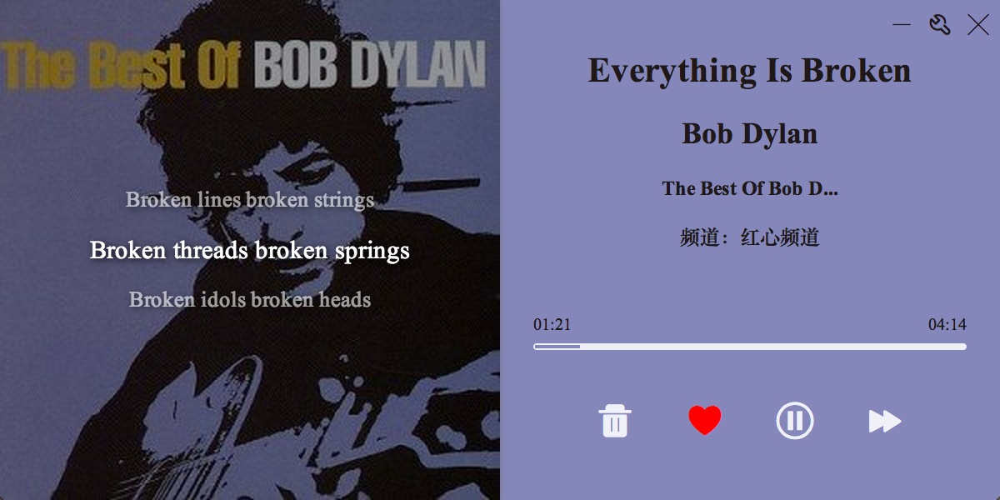
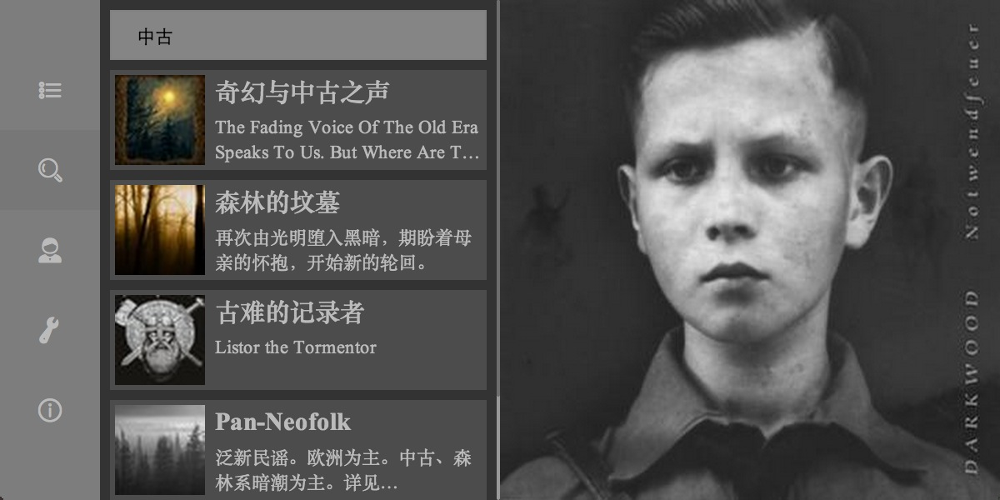
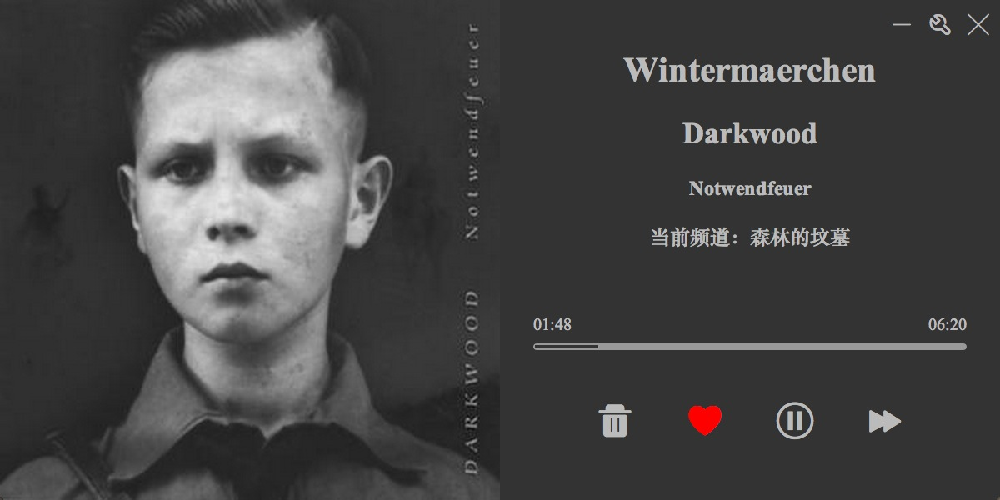

豆瓣电台 node-webkit版  -----**(MAC平台第二好用的豆瓣电台)**

##### 为什么**又**一个豆瓣电台
我自己是豆瓣电台的重度用户，用过最好的客户端是windows下的[kfstorm](www.kfstorm.com/blog/doubanfm/)，从各方面来说，这个客户端都堪称完美，唯一的遗憾是没有mac版本的，而mac平台下的各种豆瓣电台都不太好用，之前一直使用的是[diumoo](diumoo.net)，感觉还是缺了一些功能，比如频道搜索，专辑搜索等。所以用[node-webkit](github.com/rogerwang/node-webkit)和[Polymer](www.polymer-project.org/)做了这个客户端，主要是解决自己日常使用的问题。

    
##### download
- [mac版本](pan.baidu.com/s/1gd05huz)
- linux版 (敬请期待)
- windows版 (不提供，强烈推荐使用[KFStorm](www.kfstorm.com/blog/doubanfm)客户端)
    
##### 特点
- 界面高度抄袭KFStorm的客户端
- 基于HTML5，NodeJS, Polymer开发，理论上可以跨平台，前端同学有需求也可以自己改
- 支持用户创建的兆赫搜索
- 支持专辑模糊搜索（专辑名称，艺术家名称）
- 支持全局快捷键
- 支持频道收藏（暂时只能收藏在本地，未同步服务器）
- 支持歌词滚动显示

##### 截图

##### todo
- [] bug修复，稳定性增强
- [] 全局快捷键(50%)
- [] 设置(快捷键配置，是否显示歌词，桌面通知，频谱，设置导入导出) (50%)
- [x] ~~频道收藏~~ (暂时不能同步到服务器)
- [x] ~~专辑搜索~~ (翻页未完成)
- [x] ~~桌面通知~~
- [x] ~~歌词~~ (因为技术原因，不能支持桌面透明窗口，所以目前歌词是放在主界面上)
- 任务栏图标根据红心变化
- 自动检查更新
- 优化字体显示
    

##### 贡献 [How-to-run-apps](https://github.com/rogerwang/node-webkit/wiki/How-to-run-apps)
- 安装node-webkit
- 进入源码根目录，npm install
- 执行`nw ./`
- 解码器可能有问题，可以使用下载的app中的node-webkit和ffmpegsumo.so， 参考[node-webkit wiki](https://github.com/rogerwang/node-webkit/wiki/Using-MP3-%26-MP4-%28H.264%29-using-the--video--%26--audio--tags.)
