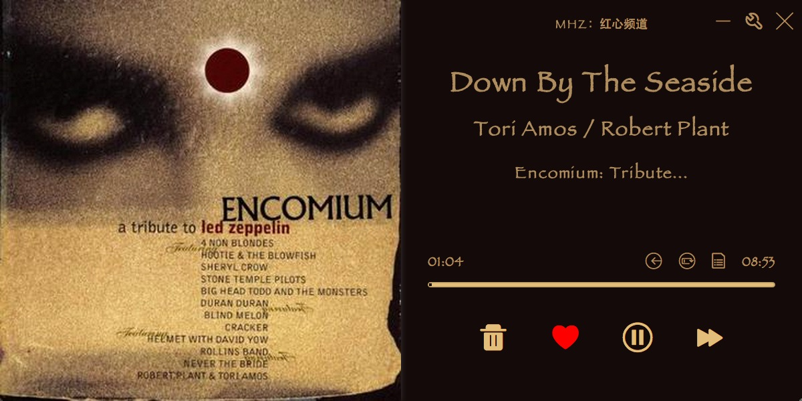
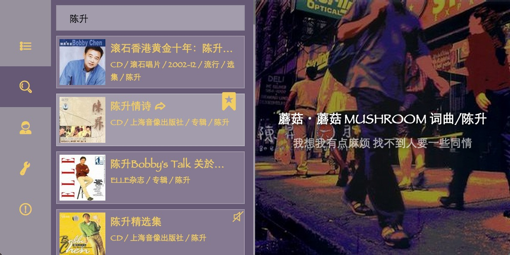
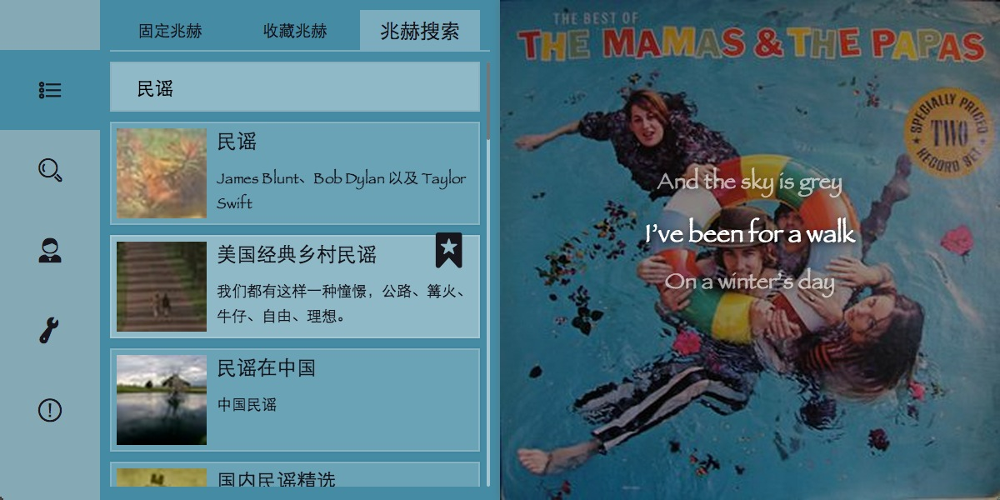
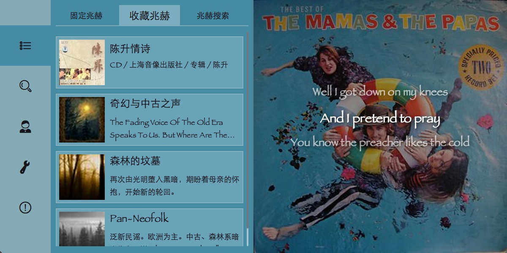
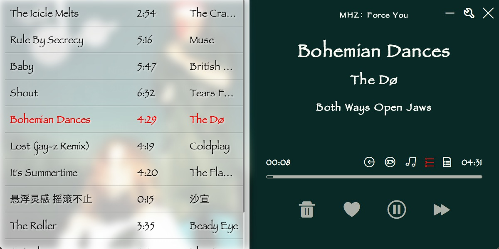
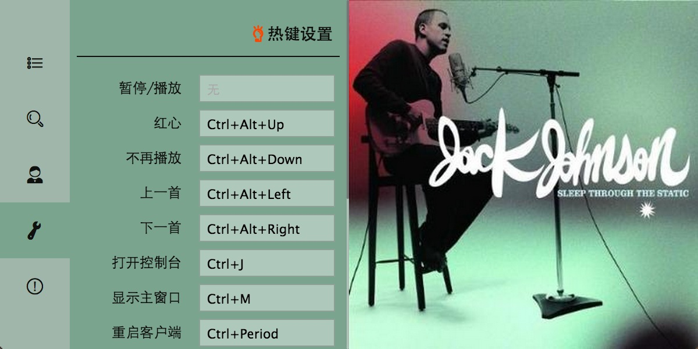

**TimoFM** -----(MAC平台第二好用的豆瓣电台)

##### 为什么**又**一个豆瓣电台 ?
我自己是豆瓣电台的重度用户，用过最好的客户端是windows下的[kfstorm](http://www.kfstorm.com/blog/doubanfm/)，从各方面来说，这个客户端都堪称完美，唯一的遗憾是没有mac版本的，而mac平台下的各种豆瓣电台都不太好用，之前一直使用的是[diumoo](http://diumoo.net)，感觉还是缺了一些功能，比如频道搜索，专辑搜索等。所以用[node-webkit](https://github.com/rogerwang/node-webkit)和[Polymer](http://www.polymer-project.org/)做了这个客户端，主要是解决自己日常使用的问题。

    
##### download
- [mac版本v1.0.10](http://pan.baidu.com/s/1pJwRql1#path=%252FAPP)
- linux版 (敬请期待)
- windows版 (不提供，强烈推荐使用[KFStorm](http://www.kfstorm.com/blog/doubanfm)客户端)

##### 更新日志
- [Release log](https://github.com/sapjax/TimoFM/wiki/release-log)

##### 特点
- 界面高度抄袭KFStorm的客户端 (嗯，就是这样)
- 基于HTML5，NodeJS, Polymer开发，理论上可以跨平台，前端同学有需求也可以自己改
- 支持用户创建的兆赫搜索
- 支持专辑模糊搜索（专辑名称，艺术家名称）
- 支持频道收藏（暂时只能收藏在本地，未同步服务器）
- 支持收听相似歌曲
- 支持全局快捷键
- 支持单曲循环
- 支持播放上一首 (咦？)
- 支持歌曲快进
- 支持桌面歌词
- 支持查看当前播放列表
- 支持桌面通知

##### 截图

##### 使用说明
- 单击专辑封面，使封面划开，可以看到其他界面，再次单击可以让封面回来原位
- 双击封面可以跳转到专辑详情页
- 无法检测Command组合键，设置快捷键时请选择CTRL/ALT作为主按键, 如果按键中有CTRL键，在使用时需要按Command键调用

##### todo
- [x] 支持桌面歌词

##### 贡献 [How-to-run-apps](https://github.com/rogerwang/node-webkit/wiki/How-to-run-apps)
- 安装node-webkit
- 进入源码根目录，npm install
- 执行`nw ./`
- 解码器可能有问题，可以使用下载的app中的node-webkit和ffmpegsumo.so， 参考[node-webkit wiki](https://github.com/rogerwang/node-webkit/wiki/Using-MP3-%26-MP4-%28H.264%29-using-the--video--%26--audio--tags.)
